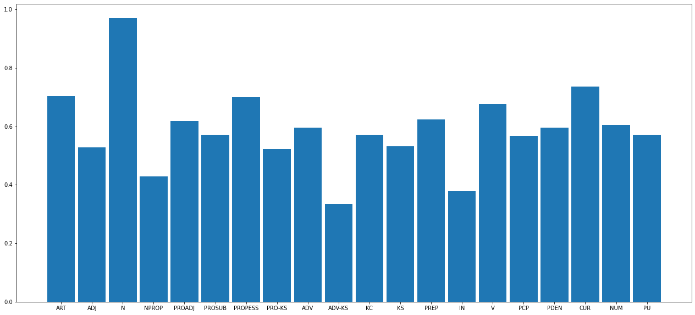

# Part o Speech Tagging of Portugese Sentences

- [Part o Speech Tagging of Portugese Sentences](#part-o-speech-tagging-of-portugese-sentences)
  - [Hidden Markov Model](#hidden-markov-model)
  - [Resultados](#resultados)
    - [Classificação de palavras](#classificação-de-palavras)
    - [Classificação de sentenças](#classificação-de-sentenças)
  - [Testes do modelo](#testes-do-modelo)

Part of speech (PoS) taggins is a fundamental technique in most natural language recognition projects, in which we try to determine the role each word plays on a sentence. For example, the sentence "Toto, I have a feeling that we are not in Kansas anymore." could be tagged as:

| Word    | Tag         |
|---------|-------------|
| Toto    | Proper noun |
| ,       | Punctuation |
| I       | Pronoun     |
| have    | Verb        |
| a       | Determiner  |
| feeling | Noun        |
| that    | Preposition |
| we      | Pronoun     |
| are     | Verb        |
| not     | Adverb      |
| in      | Preposition |
| Kansas  | Noun        |
| anymore | Adverb      |
| .       | Punctuation |

However, on this notebbok, we will be performing PoS tagging over portuguese sentences, as english PoS tagging has already been covered in many other projects. Therefore, this discussion will be carried out in portuguese from this point onwards.

If you want to learn about pos-tagging in english, you can checkout [this article](https://medium.com/data-science-in-your-pocket/pos-tagging-using-hidden-markov-models-hmm-viterbi-algorithm-in-nlp-mathematics-explained-d43ca89347c4) by Mehul Gupta who does a job that is honestly better than mine on explaining the topic in detail. You can also easily find [many implementations of PoS tagging on GitHub](https://github.com/search?q=pos-tagging).

## Hidden Markov Model

Nesses exemplos, usaremos a implementação do algoritmo _Hidden Markov Model_ (Modelo Oculto de Markov) oferecido pela biblioteca `nltk`. Esse modelo tem diversas aplicações além de _PoS tagging_ em áreas como termodinâmica, estatística, ecnomia, teoria da informação, entre outras.

Teremos um processo stocastico, mais especificamente um processo Markoviano, ou seja, temos uma sequência de variáveis aleatórias que podem assumir um conjunto de estados $Q$ onde a probabilidade de cada estado depende apenas do estado assumido na variável anterior, chamaeremos essa sequência de $X$. Teremos também uma senquência de valores observáveis $Y$ onde a ocorrência de $y_n$ está relacionada com a ocorrência de $x_n$. Baseado nisso teremos duas tabelas de probabilidade: as probabilidades de transição e as probabilidades de emissão. As probabilidades de transição indicam a probabilidade de $x_n$ assumir um dado estado baseado no estado de $x_{n-1}$:

$$P(x_n|x_{n-1})$$

Enquanto as probabilidades de emissão indicam a probabilidade de um obervável $Y_n$ ser emitido por um estado de $X$:

$$P(y_n|x_n)$$

No nosso caso, os estados assumíveis serão classes de palavras existentes na língua portugesa que aqui serão representados com: 

| Classe de palavra                      | Tag        |
|----------------------------------------|------------|
| Artigo                                 | ART        |
| Adjetivo                               | ADJ        |
| Nome                                   | N          |
| Nome próprio                           | NPROP      |
| Numeral                                | NUM        |
| Pronome adjetivo                       | PROADJ     |
| Pronome substantivo                    | PROSUB     |
| Pronome pessoal                        | PROPESS    |
| Pronome conectivo subordinado          | PRO-KS     |
| Pronome conectivo subordinado relativo | PRO-KS-REL |
| Advérbio                               | ADV        |
| Advérbio conectivo subordinativo       | ADV-KS     |
| Advérbio relativo subordinativo        | ADV-KS-REL |
| Conjunção coordenativa                 | KC         |
| Conjunção subordinativa                | KS         |
| Preposição                             | PREP       |
| Interjeição                            | IN         |
| Verbo                                  | V          |
| Verbo auxiliar                         | VAUX       |
| Particípio                             | PCP        |
| Palavra denotativa                     | PDEN       |
| Pontuação.                             | PU         |
| Moeda corrente                         | CUR        |

as tags ainda podem ser acompanhadas de informações adicionais denotadas por:

| Informação            | Modificador (_TAG_\|MOD) |
|-----------------------|--------------------------|
| Estrangeirismo        | EST                      |
| Apostos               | AP                       |
| Dados                 | DAD                      |
| Números de telefone   | TEL                      |
| Datas                 | DAT                      |
| Horas                 | HOR                      |
| Contrações e ênclises | +                        |
| Mesóclise             | !                        |


A sequência $X$ será a sequência de tags atribuídas a uma sentença fornecida e a sequência $Y$ será composta das palavras que formam a sentença. Ou seja, teremos que as probabilidades de transição serão probabilidades de que uma classe de palavra seja precedida por outra, enquanto as probabilidades de emissão serão as probabilidades de que uma determinada palavra tenha o papel de uma determinada classe de discurso. Por exemplo, suponha que a tenhamos apenas três classes de palavras: nomes, verbos e advérbios, uma possível tabela de probabilidades de transição seria:

|              | **Nome** | **Verbo** | **Advérbio** |
|--------------|----------|-----------|--------------|
| **Nome**     | 0.6      | 0.1       | 0.3          |
| **Verbo**    | 0.5      | 0.1       | 0.4          |
| **Advérbio** | 0.5      | 0.4       | 0.1          |

caso o nosso vocabulário possua apenas as palavras armando, faz e rapidamente, uma possível tabela de probabilidades de emissão seria:

|                 | **Nome** | **Verbo** | **Advérbio** |
|-----------------|----------|-----------|--------------|
| **Armando**     | 0.5      | 0.5       | 0.0          |
| **Faz**         | 0.1      | 0.9       | 0.0          |
| **Rapidamente** | 0.0      | 0.0       | 1.0          |

O _Hidden Markov Model_ monta uma máquina de estados e trabalha com iterações baseadas nas duas probabilidades mencionadas para convergir e determinar uma classificação adequada para as palavras de uma sentença. Essas probabilidades são calculadas a partir de uma análise dos dados de treino fornecidos. Veremos agora o exemplo utilizando a implementação da `nltk` do algoritmo.

Utilizaremos o corpus disponível [nesse link](http://nilc.icmc.usp.br/macmorpho/macmorpho-v3.tgz) cuja documentação pode ser obtida [aqui](http://nilc.icmc.usp.br/macmorpho/macmorpho-manual.pdf).

## Resultados

Veja alguns exemplos de classificaões realizados pelo modelo treinado:

### Classificação de palavras

Código
```python
print_tag('fugiu')
print_tag('escritório')
print_tag('rapidamente')
print_tag('R$')
print_tag('armando')
print_tag('seu')
print_tag('feliz')
```

Saída:
```
fugiu: v
escritório: n
rapidamente: adv
R$: cur
armando: nprop
seu: proadj
feliz: adj
```

### Classificação de sentenças

Código:
```python
tag_sentence('mesmo estando atrasado , parou para cumprimentá-lo')
```

Saída:
```
[('mesmo', 'pden'),
 ('estando', 'v'),
 ('atrasado', 'pcp'),
 (',', 'pu'),
 ('parou', 'v'),
 ('para', 'prep'),
 ('cumprimentá-lo', 'n')]
```

---

Código:
```python
tag_sentence('o galo ganhou mais uma vez , ai credo')
```

Saída:
```
[('o', 'art'),
 ('galo', 'n'),
 ('ganhou', 'v'),
 ('mais', 'adv'),
 ('uma', 'art'),
 ('vez', 'n'),
 (',', 'pu'),
 ('ai', 'in'),
 ('credo', 'n')]
```

---

Código:
```python
tag_sentence('que a força esteja com você')
```

Saída:
```
[('que', 'ks'),
 ('a', 'art'),
 ('força', 'n'),
 ('esteja', 'v'),
 ('com', 'prep'),
 ('você', 'propess')]
```

## Testes do modelo

Utilizando o conjunto de dados de teste incluso no corpus para testar a qualidade do modelo, podemos verificar, que houveram 119.585 classificações corretas enquanto 58.788 delas foram incorretas, isso representa uma taxa de acerto de aproximadamente 67%, o que é uma taxa razoável especialmente considerando que ela poderia provavelmente ser melhorada com ajustes nos parâmetros de treino.

[Nessa tabela](./test-result.csv) observamos os resultados obtidos no teste. As linhas representam a predição enquanto as colunas representam a resposta correta para a palavra. Podemos perceber que o erro mais comum é a classificação incorreta de palavras como nomes, isso provavelmente é devido ao fato dos nomes serem uma classe de palavras mais geral que as outras, portanto, pela característica do aprendizado de máquina, quando o modelo não sabe qual classe atribuir a uma palavra, ele tende a optar por uma classificação menos específica.

No gráfico abaixo podemos ver como essa característica está refletida na taxa de acertos dos nomes que é muito próxima de 1, em mais de 90% dos casos o modelo classifica nomes corretamente.



Outro ponto interessante a se notar, é que as classes de palavras mais comuns como artigos, nomes, pronomes e verbos têm as maiores acuracias, cerca de 70% em todos os casos, o que significa que nos casos mais comuns, a classificação é eficaz. Moedas também apresentaram uma boa precisão, provavelmente devido ao fato de que representações de moedas tendem a ser mais específicas, já que são um grupo muito restrito e frequentemente incluem caracteres que não estão contidos no alfabeto da língua portugesa.
